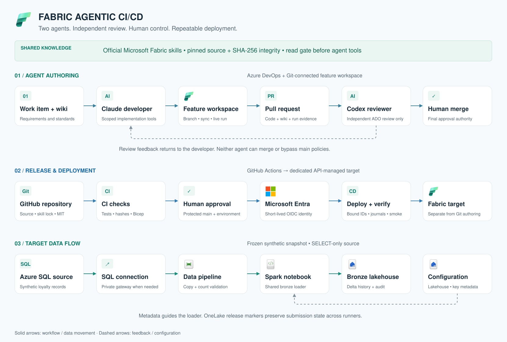
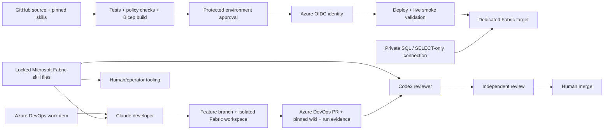

# Architecture

[Editable draw.io source](docs/diagrams/architecture.drawio) · [Full-size SVG](docs/diagrams/architecture.svg) · [Artwork credits](docs/diagrams/README.md)

The GitHub source release and optional Azure DevOps demo workflow serve different purposes. GitHub distributes and tests the whole implementation. Azure DevOps demonstrates the human clarification and independent agent PR cycle. Tenant, capacity, organization, project and connection details belong to each deployer's ignored configuration.

The deployment identity needs access only to its target workspace/capacity and the source connection. It must not have SQL write access. The developer has scoped feature Git/Fabric permissions; the reviewer has Azure DevOps read/review permissions and cannot request a Fabric token. Neither model can merge or bypass main policies. The operator performs tenant setup separately with explicit authority.

Every model process reads the same pinned upstream skill files through an integrity-checked reader. Skill-read readiness is enforced before project tools. A read receipt proves delivery of skill content to the session, not correctness of the model's conclusions. Tests, PR review and actual runtime evidence remain required.

Deployment state is journaled locally, and smoke-job submission is also recorded in OneLake so runner replacement does not erase uncertainty. A missing response is reconciled, never retried blindly. Release fingerprints include source, target configuration and the skill lock.

The direct API deployer refuses a workspace connected to Git. Git-managed authoring workspaces follow the reviewed commit/sync lifecycle instead. Main data and audit history are preserved on updates. There is no automatic broad cleanup or data rollback; recover through an explicitly reviewed release and a data-aware recovery plan.
