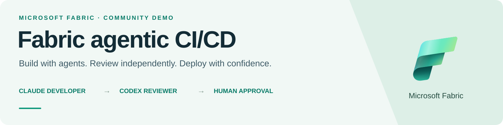

<p align="center">
  
</p>

<p align="center">
  <a href="https://github.com/roy2392/fabric-agentic-cicd/actions/workflows/ci.yml"></a>
  <a href="https://github.com/roy2392/fabric-agentic-cicd/actions/workflows/deploy.yml"></a>
  <a href="LICENSE"></a>
  <a href="https://github.com/roy2392/fabric-agentic-cicd/releases"></a>
  <a href="https://github.com/microsoft/skills-for-fabric"></a>
</p>

<p align="center">
  &nbsp; Microsoft ecosystem &nbsp;·&nbsp;
  &nbsp; Microsoft Fabric &nbsp;·&nbsp; Azure DevOps &nbsp;·&nbsp; GitHub Actions
</p>

<p align="center">
  <a href="#architecture">Architecture</a> ·
  <a href="#quick-start">Quick start</a> ·
  <a href="docs/DEPLOYMENT.md">Deploy</a> ·
  <a href="docs/AGENTS-SETUP.md">Run the agents</a> ·
  <a href="https://github.com/roy2392/fabric-agentic-cicd/releases/tag/v0.1.0">Verified release</a>
</p>

## From work item to reviewed Fabric change

A Claude developer implements a scoped data-engineering task. An independent Codex reviewer checks the code and evidence. A human owns the merge decision. GitHub Actions tests and deploys the portable implementation through a protected environment using Azure OIDC.

**The operator and both agents use the same pinned [official Microsoft Fabric skills](https://github.com/microsoft/skills-for-fabric).** Agent tools stay locked until the session reads its required upstream skill files.

| Build with context | Review independently | Deploy with evidence |
| :--- | :--- | :--- |
| Work items, wiki standards, and official skills guide the developer. | Codex has review access; it has no Fabric execution tools. | CI, human approval, short-lived identity, and recorded validation protect releases. |
| A feature branch and isolated Fabric workspace contain the change. | Review findings return to the developer for correction. | Release markers prevent blind resubmission after an interrupted run. |

## Architecture

<a href="docs/diagrams/architecture.svg"></a>

**[Open the full-size diagram](docs/diagrams/architecture.svg)** · **[Download the editable draw.io source](https://raw.githubusercontent.com/roy2392/fabric-agentic-cicd/main/docs/diagrams/architecture.drawio)** · **[Architecture details](ARCHITECTURE.md)**

Open the `.drawio` file in [diagrams.net](https://app.diagrams.net/) or draw.io Desktop. Shapes, labels, connectors, and embedded official icons remain editable. [Diagram source and artwork credits](docs/diagrams/README.md).

GitHub distributes and tests the implementation. The optional agent work-item/PR loop uses your Azure DevOps project. API deployment targets a dedicated workspace; Git-connected authoring workspaces follow their reviewed commit/sync lifecycle.

## What has been verified

| Evidence | Result | Inspect |
| :--- | :--- | :--- |
| Real agent skill-read probes | Claude and Codex both passed | [Validation record](docs/VALIDATION.md) |
| GitHub CI | 73 tests, skill hashes, publication checks, Bicep compilation, local harness | [Passing release CI](https://github.com/roy2392/fabric-agentic-cicd/actions/runs/36463571453) |
| Fresh Fabric deployment | Seven successful activities; source/raw/current/history counts all 3 | [Release evidence](https://github.com/roy2392/fabric-agentic-cicd/releases/tag/v0.1.0) |
| GitHub OIDC deployment | Application authentication and deployment passed; recorded smoke job revalidated | [Successful deployment attempt](https://github.com/roy2392/fabric-agentic-cicd/actions/runs/36462883796/attempts/2) |

These are distinct checks. The local harness uses scripted events; the model probes only read skills. The GitHub redeployment reused the completed smoke job instead of submitting a second Spark run. Live badges above show workflow status; this table records the verified v0.1.0 baseline.

## Quick start

**Try the workflow locally without cloud credentials.** Requires Python 3.12 and Git. Tests and deployment support Linux and macOS.

```bash
git clone https://github.com/roy2392/fabric-agentic-cicd.git
cd fabric-agentic-cicd
python3.12 -m venv .venv
source .venv/bin/activate
python -m pip install -r requirements.lock cryptography==46.0.5

python -m scripts.skill_registry --verify
python -m pytest -q
python -m fabric_agents.cli demo --output .runs/my-demo
python -m scripts.deploy plan --config deployment/target.example.json
```

The example target contains placeholder IDs. `plan` is offline; it does not provision resources. The local demo demonstrates orchestration and evidence handling, not real model or cloud execution.

## Deploy to your Fabric tenant

Bring an active Fabric capacity, an authorized Azure CLI/OIDC identity, a tested SELECT-only SQL connection, and the synthetic table from [`demo/synthetic-source.sql`](demo/synthetic-source.sql). Keep the source frozen during the separate copy/count statements.

```bash
cp deployment/target.example.json config/target.local.json
# Set your tenant, capacity, connection, database and dedicated workspace.
az login --tenant YOUR_TENANT_ID --allow-no-subscriptions
python -m scripts.deploy plan --config config/target.local.json
python -m scripts.deploy apply --config config/target.local.json --smoke
```

The deployer binds discovered target IDs, creates two schema-enabled lakehouses, deploys a shared notebook and two pipelines, stages composite-key metadata, and validates the expected activity results and row counts.

**[Follow the deployment guide →](docs/DEPLOYMENT.md)** for private networking, permissions, GitHub environment variables, and the exact OIDC subject. Each fork supplies its own identity and trust. Optional SQL/network Bicep creates billable resources only when explicitly deployed.

## CI/CD and controls

| Stage | Enforced behavior |
| :--- | :--- |
| Pull request / main CI | Regression tests, pinned skill integrity, release checks, Bicep compilation, offline deployment plan, deterministic harness |
| Deployment approval | Manual dispatch from main into a protected GitHub Environment |
| Cloud authentication | Azure OIDC with the repository's exact immutable subject; no stored client secret |
| Deployment | Bind target IDs, reject unrelated or Git-connected targets, check active jobs, journal operations |
| Validation and recovery | Check all seven activities and row counts; preserve reports and OneLake submission markers |

Main requires CI and PR approval. Human environment approval gates this repository's deployment. Configure equivalent protections in your fork before granting cloud access. Definitions can be redeployed from a reviewed revision; this is not an automatic data rollback.

## One official skill source, three roles

[`skills.lock.json`](skills.lock.json) pins the unmodified Microsoft source to `6c11ad58c25992e5d1435ce7cd80d217d5598a31`. Every vendored file is hashed; upstream licensing is preserved.

| Role | Skill access | Authority |
| :--- | :--- | :--- |
| Operator | Repository instructions and verified upstream references | Authorized setup and release operations |
| Claude developer | Integrity-checked MCP reader; required reads before project tools | Assigned feature implementation and execution |
| Codex reviewer | Same pinned reader with an independent session gate | Azure DevOps read/review; no Fabric execution |

```bash
# Requires installed CLIs and configured Claude Foundry / Codex authentication.
python -m scripts.probe_agents developer
python -m scripts.probe_agents reviewer
```

Read receipts prove delivery of skill content, not correctness of a model's conclusions. Runtime tests, independent review, and human decisions remain necessary. **[Configure the real agents →](docs/AGENTS-SETUP.md)**

## Project guide

| Path | Purpose |
| :--- | :--- |
| [`agents/`](agents/) | Developer and reviewer instructions |
| [`scripts/`](scripts/) | Bounded tools, dispatchers, deployment and skill verification |
| [`platform/bronze_loader.py`](platform/bronze_loader.py) | Shared Spark bronze loader |
| [`infra/main.bicep`](infra/main.bicep) | Optional private SQL and network infrastructure |
| [`.github/workflows/`](.github/workflows/) | CI and protected deployment workflows |
| [`vendor/skills-for-fabric/`](vendor/skills-for-fabric/) | Pinned official skills and references |
| [`docs/diagrams/`](docs/diagrams/) | Editable architecture and SVG preview |

## Scope

This is a synthetic full-snapshot demo, capped at 10,000 rows. Watermark metadata is recorded; incremental SQL extraction is not implemented. The loader rejects unsupported deletions, schema drift, and out-of-order snapshots. The two local model runtimes share an OS account, so the demonstrated separation is in tools and cloud identities.

The original narrated video predates the portable skills/CI upgrade. Current proof is recorded separately. Credentials, local manifests, private checklists, recordings, and raw `.runs/` data stay outside Git. See [SECURITY.md](SECURITY.md).

## License and acknowledgments

Project code is available under the **[MIT License](LICENSE)**. Built using [Microsoft Fabric](https://www.microsoft.com/microsoft-fabric) and the official [Microsoft Fabric skills](https://github.com/microsoft/skills-for-fabric).

Microsoft and Fabric artwork is reproduced from official Microsoft sources for documentation; trademarks and artwork retain their respective terms and are not relicensed under MIT. This is a community demo, not a Microsoft-supported product. See [third-party notices](THIRD_PARTY_NOTICES.md) and [artwork sources](docs/diagrams/README.md).
