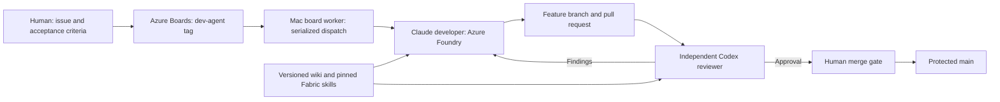
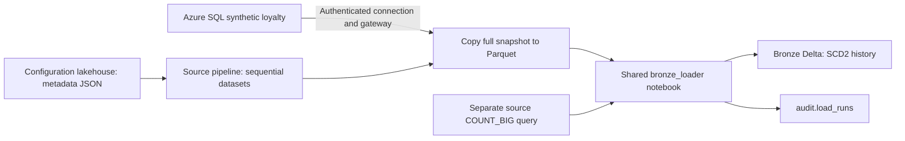

# Architecture

## Control flow

## Data flow for the original onboarding lane

The copy and count statements do not share a database snapshot. Keep the synthetic source frozen during both. Watermark metadata does not make extraction incremental.

## Components and ownership

| Component | Responsibility | Boundary |
|---|---|---|
| Azure DevOps solution repository | Source definitions, feature branches, PR review | Protected main; human merge |
| Azure DevOps wiki | Versioned platform and source context | Read-only in assignment agent tools |
| GitHub distribution repository | Portable implementation, CI, deployment configuration and handbook source | No live manifests, identities' credentials or private reviewer instructions |
| Mac operator runner | Invokes one real model session at a time and stores private evidence | Mac must be awake and runner available; not a cloud daemon |
| Claude developer | Assigned files and local checks | Exact file allowlist; no assignment-tool Fabric execution |
| Codex reviewer | Independent source review and vote | Separate identity; no source-write, shell or Fabric execution tool |
| Human operator | Ambiguity decisions, environment selection, protected merge and authorized release | No automatic bypass |

The scheduled controller uses a lock and durable state. A timeout or interrupted process blocks automatic replay until reconciled. It does not reset journals, silently expand scope or retry a blocked agent.

## Deployment boundary

Git integration transports Fabric item definitions. It does not prove a job ran successfully, recreate credentials or guarantee every environment-specific binding is correct. Use the repository's declared deployment configuration and approval-protected workflow. Verify source revision, resolved dependencies and actual job evidence separately.
